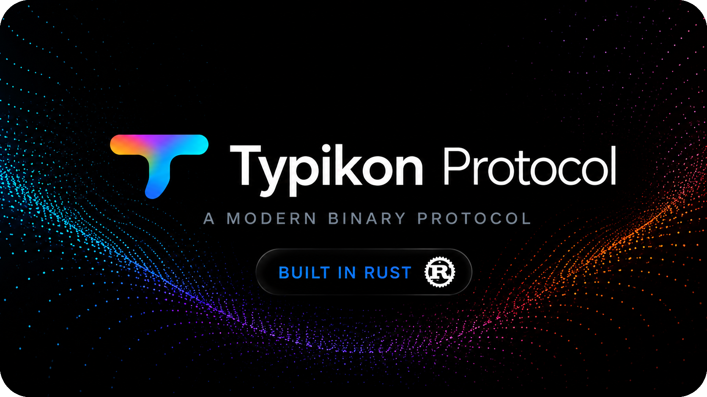

# Typikon Protocol



[](#что-реально-проверено)
[](#что-реально-проверено)
[](README.en.md)
[](https://ripcats.t.me)

**Typikon — язык схем и компилятор для типизированного бинарного wire-протокола.**

Опишите контракт в человекочитаемой схеме `.typ` — Typikon проверит её семантику и выпустит schema-specific Rust wire core, публичную схему с вычисленными **Constructor ID (C-ID)** и официальные кроссплатформенные адаптеры для Python, Go и TypeScript.

> **Beta-версия.** Проект уже собирается, тестируется и генерирует рабочие артефакты, но формат протокола и правила вычисления C-ID ещё могут измениться.

## Зачем нужен Typikon

Вместо ручной поддержки бинарного формата, сериализации и нескольких языковых реализаций контракт описывается один раз:

~~~text
schema.typ
    │
    ├── parser + semantic validation
    ├── canonical form + BLAKE3 C-ID
    ├── generated Rust wire core
    └── generated Python / Go / TypeScript adapters
~~~

На wire остаются бинарные данные. JSON не участвует в typed Go и TypeScript codec paths и не является форматом Typikon; Python binding также передаёт значения через PyO3/pythonize без JSON-сериализации.

Typikon задуман как кроссплатформенный протокол. На текущем этапе проект официально предоставляет адаптеры для **Python**, **Go** и **TypeScript**; в дальнейшем список реализаций может расширяться сообществом и новыми официальными bindings.

## Возможности

| Возможность | Что даёт |
| --- | --- |
| Декларативные `.typ`-схемы | Один источник истины для типов и wire-контракта |
| `struct` и data-bearing `enum` | Конструкторы с проверяемыми C-ID |
| Flags и `#[guard(...)]` | Условные поля без неявной nullable-семантики |
| VarInt, коллекции и Map | Компактное и детерминированное кодирование |
| Layer negotiation | Явная проверка совместимости схем |
| Rust code generation | Единая реализация encode/decode |
| Языковые адаптеры | Python через PyO3, Go native wire codec + cgo validation, TypeScript typed wire codec + Node-API validation |
| Строгая валидация и лимиты | Предсказуемое поведение на повреждённом вводе |

## Быстрый старт

~~~bash
cargo run -- check examples/messenger.typ
# valid Layer 10: messenger.typ

cargo run -- compile examples/messenger.typ \
  --out-dir /tmp/typikon-messenger \
  --target python,golang,typescript
~~~

Проверки репозитория:

~~~bash
cargo fmt --check
cargo test
cargo clippy --all-targets --all-features -- -D warnings
cargo check --manifest-path fuzz/Cargo.toml
~~~

## Язык схем

~~~rust
#[version(10)]

#[flags(u16)]
enum UserFlags {
    IsBot = 0,
    HasAvatar = 1,
}

struct User {
    id: u64,
    name: String,
    flags: UserFlags,

    #[guard(flags.has_avatar)]
    avatar_url: String,
}

enum Message {
    Text { text: String },
    Image { data: Vec<u8> },
}
~~~

### Синтаксис и типы

Файл начинается с обязательного Layer, после которого идут объявления flags, структур и enum:

```rust
#[version(10)]

#[flags(u8)]
enum MessageFlags {
    IsPinned = 0,
    HasReply = 1,
}

struct Message {
    id: u64,
    text: String,
    flags: MessageFlags,
    attachments: Vec<Attachment>,
}

struct Attachment {
    name: String,
    data: Vec<u8>,
}
```

Поддерживаемые типы:

| Категория | Типы |
| --- | --- |
| Логика | `bool` |
| Беззнаковые числа | `u8`, `u16`, `u32`, `u64`, `u128` |
| Знаковые числа | `i8`, `i16`, `i32`, `i64`, `i128` |
| Числа с плавающей точкой | `f32`, `f64` |
| Текст и байты | `String`, `Vec<u8>` |
| Коллекции | `Vec<T>`, `Map<K, V>` |
| Пользовательские типы | имена `struct`, `enum` и flags |

`Vec<T>` может быть вложенным: `Vec<Vec<u8>>`, `Map<String, Vec<Message>>`. Ключ `Map<K, V>` должен быть primitive-типом, кроме `f32` и `f64`; пары кодируются в отсортированном порядке.

## Zero-copy decode — beta

Generated Rust layer создаёт borrowed-view для структур с прямыми полями `String` и `Vec<u8>`, а также рекурсивно протягивает view через вложенные named structures:

~~~rust
let message = MessageRef::decode_borrowed(&packet)?;
let text: &str = message.text;
~~~

`&str` и `&[u8]` указывают прямо внутрь входного packet buffer, поэтому buffer обязан жить дольше view. Например, `MessageRef.sender` имеет тип `UserRef<'a>`, а `roles`, `attachments` и `metadata` представлены lazy borrowed views. Их итераторы декодируют элементы по мере чтения, без создания owned `Vec`/`BTreeMap`; объекты language bridge пока остаются owned values.

Runtime API для этого публичный: `typikon::BorrowedWireCodec`, `typikon::decode_borrowed_value`, `typikon::BorrowedVec` и `typikon::BorrowedMap` экспортируются из crate root. Rust generated core может использовать их напрямую; Python, Go и TypeScript adapters пока возвращают owned language values, потому что их FFI lifetime/ownership contracts требуют отдельного безопасного view handle.

Для transport-level framing `Encoder` также предоставляет `write_vectored`: header, packet и trailer можно отправить через один vectored write без промежуточной конкатенации. API не привязан к TCP и подходит для TCP+TLS-адаптеров; QUIC, WebSocket и WebTransport могут использовать тот же готовый packet buffer и собственные message/frame boundaries.

### Flags и Guard-биты

Flags — это enum с атрибутом `#[flags(u8)]`, `#[flags(u16)]`, `#[flags(u32)]`, `#[flags(u64)]` или `#[flags(u128)]`. Значение после `=` — номер бита от `0` до последнего бита underlying-типа:

```rust
#[flags(u16)]
enum UserFlags {
    IsBot = 0,
    IsVerified = 1,
    HasAvatar = 2,
}
```

`#[guard(flags.bit_name)]` связывает поле с ранее объявленным flags-полем:

```rust
struct User {
    id: u64,
    flags: UserFlags,

    #[guard(flags.is_verified)]
    verified_at: u64,

    #[guard(flags.has_avatar)]
    avatar_url: String,
}
```

Механика guard на wire простая:

1. flags-поле кодируется в обычной позиции;
2. для каждого guarded-поля проверяется указанный бит;
3. бит `1` — поле кодируется сразу после предыдущего поля;
4. бит `0` — поле полностью пропускается и не занимает ни одного байта.

Поэтому flags-поле обязано физически идти раньше всех полей, которые от него зависят. В Rust API guarded-поля представлены как `Option<T>`: `Some(value)` при установленном бите и `None` при сброшенном. Flags сами по себе не являются constructor’ами и не получают Constructor ID.

Опциональность в Typikon всегда явная: отдельного `Option<T>` или `nullable<T>` в синтаксисе схем нет.

### Struct, enum и unit enum

`struct` описывает один constructor:

```rust
struct User {
    id: u64,
    name: String,
}
```

Data-bearing `enum` описывает несколько вариантов, каждый со своим Constructor ID:

```rust
enum Update {
    NewMessage { message: Message },
    MessageEdited { id: u64, text: String },
}
```

Enum без полей — integer enum без Constructor ID. Значения должны быть явными и уникальными:

```rust
enum Presence {
    Offline = 0,
    Online = 1,
}
```

Trailing comma разрешена. Имена типов, полей и вариантов должны быть уникальными в своей области схемы. Generated-файлы не редактируются вручную.

### Wire-правила

- числа кодируются fixed-width в little-endian;
- строки и коллекции используют VarInt для длины или count;
- `Map<K, V>` принимает primitive-ключи, сортирует пары и отклоняет duplicate keys;
- лимит пакета runtime — 4 MiB, максимальная глубина типов — 100;
- trailing bytes, malformed и truncated values отклоняются.

### Constructor ID (C-ID)

Constructor — это конкретный тип сообщения, который умеет кодироваться и декодироваться. Каждый `struct` и каждый data-bearing `enum` получает Constructor ID автоматически:

~~~text
AST constructor → canonical form → BLAKE3
              → первые 16 hex-символов → 8 raw bytes на wire
~~~

Canonical form учитывает имя constructor’а, порядок полей, типы и guard-условия. Форматирование и комментарии не влияют на C-ID; Layer в него не входит. Для fingerprint используется BLAKE3 — единственная криптографическая зависимость проекта.

~~~text
[8 raw C-ID bytes][encoded fields]
~~~

Артефакт `{name}-{layer}.public.typ` — компактный read-only паспорт схемы с вычисленными `#[cid(...)]`. Его можно повторно распарсить и сравнить с результатом компиляции.

## Demo: messenger

Основной пример — [`examples/messenger.typ`](examples/messenger.typ), схема Layer 10 для мессенджера с flags, presence, пользователями, вложениями, сообщениями и update-событиями. Рядом лежит воспроизводимый [`messenger-10.public.typ`](examples/messenger-10.public.typ).

CLI создаёт:

~~~text
messenger-10.rs              Rust wire core
messenger-10.public.typ      public schema with C-IDs
python.messenger-10.rs       Python native bridge
messenger_10.py              Python facade
golang.messenger-10.rs       Go native bridge
messenger-10.go / .h         Go API и C header
typescript.messenger-10.rs  TypeScript native bridge
messenger-10.ts              TypeScript facade
~~~

`fixtures/` содержит небольшие regression-схемы, а не готовые приложения.

## Runtime и bindings

Единственная schema-specific реализация binary encode/decode находится в generated Rust core. Общий runtime — в [`src/wire.rs`](src/wire.rs), [`src/codec.rs`](src/codec.rs), [`src/constructor.rs`](src/constructor.rs) и связанных модулях.

- **Python** — PyO3 и прямое преобразование dict/list/scalar через `pythonize`.
- **Go** — schema-specific native Go wire codec; cgo остаётся для ABI и borrowed validation.
- **TypeScript** — typed direct wire codec и Node-API native validation addon.

Все адаптеры используют один wire contract. Go codec генерируется как прямой native Go encoder/decoder, TypeScript — как typed wire codec с native Node-API validation, Python — через прямую PyO3-конверсию.

## Layer и совместимость

Layer — самостоятельная версия схемы, а не наследуемый набор изменений:

~~~rust
let support = LayerSupport::new([6, 8, 10]);
assert_eq!(support.negotiate(8), Ok(8));
assert!(support.negotiate(9).is_err());
~~~

Поддержан только Layer, для которого реально собран backend. Иначе runtime возвращает `LayerVersionNotSupported`. Наследования Layer, `extends`, `@since` и неявного диапазона версий нет.

## Идея и область применения

Typikon — собственная schema-driven реализация бинарного протокола, вдохновлённая **[TL](https://github.com/gotd/td)** и **[Protocol Buffers](https://github.com/protocolbuffers/protobuf)**. Проект рассчитан прежде всего на messenger-подобные системы, где важны компактные сообщения, явные версии Layer, стабильные Constructor ID, условные поля и один wire-контракт для нескольких языков.

Транспорт и прикладная логика в Typikon намеренно остаются отдельным уровнем. Здесь — схема, wire-кодирование, совместимость Layer и генерация адаптеров. Python binding собирается, но package/install workflow ещё не оформлен; native crates Go и TypeScript собираются отдельно.

## Что реально проверено

Текущая Rust-проверка включает **52 теста: 49 unit и 3 integration**. Покрыты parser и semantic validation, code generation, воспроизводимость public schema, CLI, Layer negotiation, C-ID, round-trip primitive/collection wire-кодирования, лимиты, malformed/truncated input, duplicate Map keys, canonical VarInt, borrowed decode, lazy borrowed collections, vectored write и случайные parser/wire inputs.

Воспроизводимые benchmarks запускаются командами `cargo bench --bench wire` и `cargo bench --bench compare`. Первый показывает внутренние пути Typikon, второй сравнивает с FlatBuffers baseline, тяжёлую collection-heavy схему и бинарные payload’ы размером 64 KiB и 1 MiB: размер wire, encode, owned decode, borrowed decode с полной итерацией и число аллокаций. Для FlatBuffers отдельно показываются verified и unchecked view paths: unchecked — только raw speed ceiling для уже проверенных packet’ов. Большие payload’ы прогоняются меньшим числом итераций. Результат зависит от CPU и профиля сборки и не считается сетевым benchmark.

В репозитории также есть проверки сборки Python binding и native crates Go/TypeScript. TypeScript facade проверяется через `npm test`, а Go facade — через `go test ./bindings/go`; golden wire round-trip совпадает для Python, TypeScript и Go.

Для длительной проверки можно запустить `TYPIKON_STRESS_SECONDS=172800 ./tests/long_validation.sh`. Скрипт повторяет release-тесты, native TypeScript tests, TypeScript typecheck и cross-language round-trip, сохраняя лог в `/home/evgeny/tmp/typikon-long-validation.log`.

## Структура

~~~text
src/                  parser, validator, runtime, compiler, codegen
examples/             messenger schema и public artifact
fixtures/             regression-схемы
bindings/python/      PyO3 binding
bindings/go/          cgo binding и native crate
bindings/typescript/  Node-API binding и TS facade
tests/                CLI, artifact и cross-language checks
CHANGELOG.md           история изменений с initial beta
~~~

История изменений и текущие ограничения beta ведутся в [`CHANGELOG.md`](CHANGELOG.md).

## Лицензия

Typikon распространяется по лицензии [MIT](LICENSE). Copyright © 2026 [ripcats](https://ripcats.t.me).
